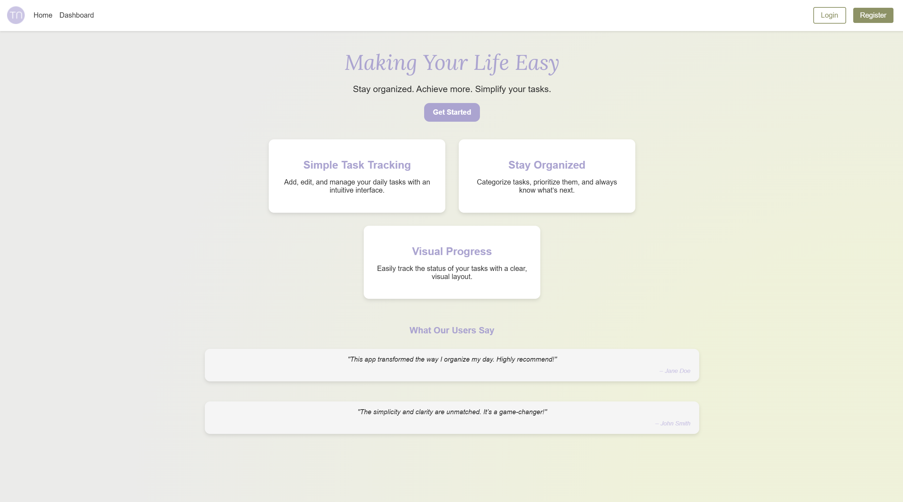
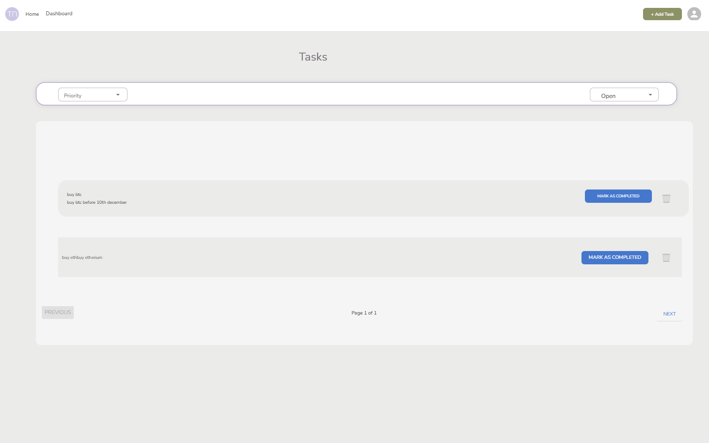
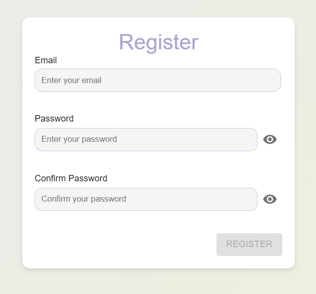
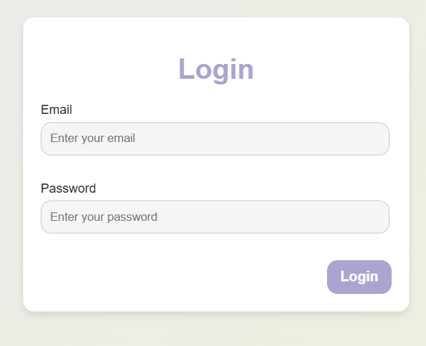

# TaskNest

    

---

## Project Goals

TaskNest is designed to simplify task management by providing a centralized platform to plan, organize, and track tasks effectively. Its key goals include:

1. **Ease of Use**: A minimalistic and user-friendly interface designed for individuals and teams.
2. **Feature-Focused Development**: Core features are prioritized to meet user needs effectively while leaving room for future enhancements.
3. **Efficiency and Reliability**: Fast and dependable tools for managing tasks, ensuring user satisfaction.

---

## Table of Contents

- [TaskNest](#TaskNest)
  - [Project Goals](#project-goals)
  - [Table of Contents](#table-of-contents)
  - [Features](#features)
  - [Design](#design)
    - [Colors](#colors)
    - [Fonts](#fonts)
  - [Core Pages](#core-pages)
    - [Landing Page](#landing-page)
    - [Registration Page](#registration-page)
    - [Login Page](#login-page)
    - [Dashboard](#dashboard)
  - [State Management](#state-management)
  - [Testing and Validation](#testing-and-validation)
  - [Future Improvements](#future-improvements)
  - [Deployment](#deployment)
  - [Credits](#credits)

---

## Features

### Core Features
- **Task Management**: Users can create, update, and delete tasks easily.
- **User Authentication**: Secure registration and login processes.
- **Responsive Design**: Optimized for mobile, tablet, and desktop devices.
- **Snappy Notifications**: User-friendly snackbars replace intrusive alerts.
- **Role-Based Views**: Different functionalities for regular users and administrators.

All Pages on the website are responsive and have:
A favicon in the browser tab.

    

### The 404 Error Page

The 404 error page displays an error message to the user and a link to go back to the login page.

### CRUD Functionality

This project implements full **Create**, **Read**, **Update**, and **Delete** functionality via the React-based UI and Django Rest Framework API.

#### **Create**
- Users can register new accounts using their email and password.
- Authenticated users can create new tasks, specifying details such as title, description, and deadline.

#### **Read**
- Users can view a list of tasks they have created, along with their details (title, description, deadline, and status).
- Logged-in users can view their login status information such as their email address under the "Avatar" icon.

#### **Update**
- Users can update their tasks, modifying details such as the title, description, and deadline and more.

#### **Delete**
- Users can delete tasks they no longer need.

This core CRUD functionality empowers users to efficiently manage their tasks, providing an intuitive and user-friendly experience.

## Design

### Wireframe

    

### Colors
The application follows a clean and modern color scheme, designed for simplicity and accessibility:

| Purpose              | Color Code | Example Color                        |
|----------------------|------------|--------------------------------------|
| Primary Accent       | `#aca3d3`  |  |
| Secondary Accent     | `#9e9cc3`  |  |
| Highlight            | `#cd584f`  |  |
| Background           | `#ebebea`  |  |
| Light Font           | `#ffffff`  |  |
| Dark Font            | `#2b2b2b`  |  |
| Muted Background     | `#b7b3cd`  |  |
| Accent Contrast      | `#ccc4e7`  |  |
| Highlight Contrast   | `#6c7c2c`  |  |
| Tertiary Background  | `#746c76`  |  |

### Fonts
- **Body Font**: Arial for content and UI clarity.
- **Enhance Font**: Lora (Italic) for hero sections and inspirational text.

---

## Core Pages

### Landing Page
- **Relevant User Story**:
  - *As a user, I want to understand the purpose of the application when I visit the homepage, so I can decide whether to register or log in.*
- **Features**:
  - Introductory content about the app.
  - Navigation options for registering or logging in.
  - Hero section featuring catchphrases.
  - Highlighted features presented in cards with rounded edges.
  - Testimonials and engaging call-to-action elements.

    

---

### Registration Page
- **Relevant User Story**:
  - *As a user, I want to register with my email and password, so I can create an account to access the application.*
- **Features**:
  - A simple form allowing users to create an account.
  - Real-time validation for passwords and email uniqueness.
  - Intuitive error/success indicators.
  - Snackbar notifications for registration success or failure.

    

---

### Login Page
- **Relevant User Story**:
  - *As a user, I want to log in with my email and password, so I can access my account and tasks.*
- **Features**:
  - A quick and secure login experience.
  - Smooth transitions and responsive design.
  - Error handling with user-friendly notifications.

    

---

### Dashboard
- **Relevant User Stories**:
  - *As a user, I want to view all my tasks, so I can manage them efficiently.*
  - *As a user, I want to filter tasks by priority and state, so I can focus on specific tasks.*
  - *As a user, I want to paginate tasks, so I can navigate through a large number of them.*
  - *As a user, I want to delete or mark a task as completed, so I can update its status.*
- **Features**:
  - The central hub for managing tasks:
    - View, edit, and delete tasks.
    - Task filtering by priority and state.
    - Pagination for navigating tasks.
  - Confirmation dialog for destructive actions (delete/mark as complete).
  - Snackbar notifications for actions like deletion or completion.

    

---

### Task Detail Page
- **Relevant User Story**:
  - *As a user, I want to view the details of a task, so I can see its description, due date, and other properties.*
- **Features**:
  - Displays detailed information about a specific task.
  - Buttons for updating or deleting the task.
  - Visual cues for overdue tasks.

    

For more information regarding the User Stories, please see the GitHub project board:

---

## State Management
The application uses React state hooks for:
- **Authentication**: Maintaining user login status and tokens.
- **Task Updates**: Automatically refreshing the task list on changes.
- **UI Notifications**: Triggering Snackbars for user feedback.

## Reusable Components

### 1. **Navbar**
- **File Location**: `src/components/Navbar.js`
- **Description**: A responsive navigation bar for managing navigation links across the app.
- **Features**:
  - Displays different links for authenticated and unauthenticated users.
  - Handles logout functionality.
  - Fully responsive for mobile and desktop views.

---

### 2. **Login Form**
- **File Location**: `src/components/LoginForm.js`
- **Description**: A reusable form for user login.
- **Features**:
  - Accepts `username` and `password` as inputs.
  - Includes client-side validation.
  - Integrates with the backend for JWT-based authentication.

---

### 3. **Register Form**
- **File Location**: `src/components/RegisterForm.js`
- **Description**: A reusable form for user registration.
- **Features**:
  - Collects `email`, `password`, and `confirm password`.
  - Includes validation for password matching.
  - Sends data to the backend for user registration.

---

### 4. **Task List**
- **File Location**: `src/components/TaskList.js`
- **Description**: Displays a list of tasks with filtering and pagination functionality.
- **Features**:
  - Dynamic task rendering with filters like `priority`, `state`, and `category`.
  - Integrated pagination for large task datasets.
  - Includes action buttons for "Delete" and "Mark as Completed".

## Testing and Validation

- **Manual Testing**: Tasks were tested across major browsers and devices to ensure responsiveness and functionality.

## Testing

Please refer to [TESTING.md](testing.md) file for all testing carried out.

- **Accessibility**: Validated with WAVE tools and Lighthouse for 100% accessibility scores.
- **Code Validation**: Passed through ESLint and W3C CSS Validator.

---

## Future Improvements

1. **Integration with Calendars**: Sync tasks with third-party calendar apps.
2. **Enhanced Filters**: Add advanced filtering options for task categorization.
3. **Multiple Owners**: Ability to assign a task for someone else.
---

## Deployment

---

## Credits

### Icons
- **Source**: [Material Icons by Google](https://mui.com/material-ui/material-icons/)
- **Description**: Icons used throughout the app (e.g., delete, edit, check) are from Material Icons.

### Favicon and Logo
- **Source**: [Favicon.io](https://favicon.io/)
- **Description**: The favicon and logo for the application were generated using Favicon.io.

### Acknowledgments

I would like to acknowledge the following people:

* Jubril - My Code Institute Mentor.
* My family and friends for testing the application.

